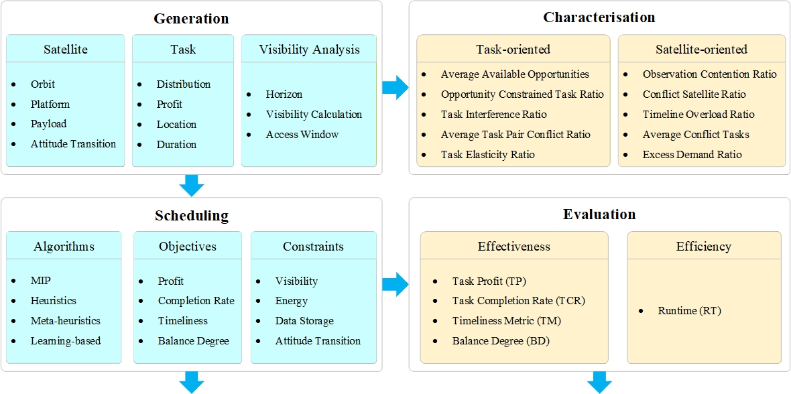
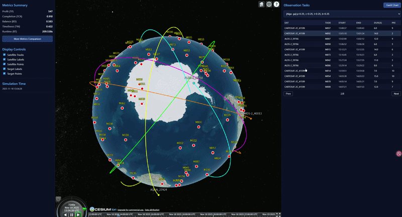
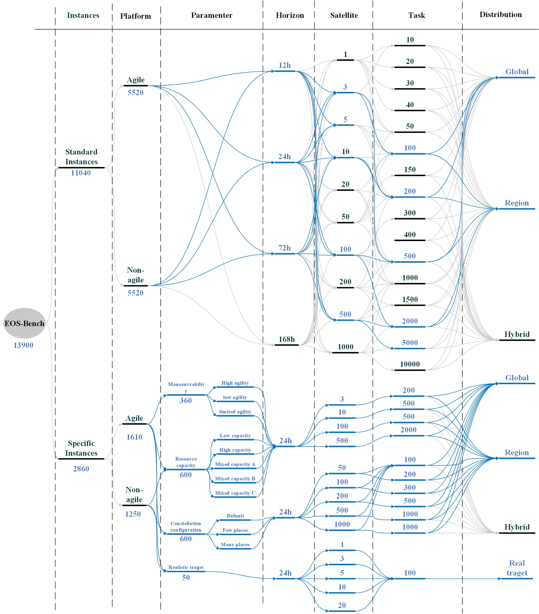

# 🚀 EOS-Bench
**A unified and extensible benchmark platform for Earth Observation (EO) satellite scheduling**

<table>
  <tr>
    <td colspan="2" align="center">
        <br />
    </td>
  </tr>
<tr>
    <td colspan="2" align="center">
        <b>Visualisation</b>
        
        <br/>
        ✨ <b>Interactive 3D Demo:</b> <a href="https://ethan19yq.github.io/EOS-Bench/cesium_viewer.html?scenario_name=Scenario_S1_Sats10_M200_T0.5d_dist0&runlog=runlog_batch_20260427_172355.txt">Click here to view the live schedule demo!</a> ✨
    </td>
  </tr>
</table>


EOS-Bench is a research-oriented benchmark platform for **Earth observation satellite scheduling**. It is designed to support **reproducible algorithm comparison**, **large-scale scenario generation**, and **end-to-end evaluation** across classical optimisation methods and learning-based schedulers.

The platform covers the full workflow of EO scheduling experiments:

- realistic scenario generation based on **Orekit**
- unified constraint modelling for EO scheduling
- standardised multi-objective evaluation
- benchmarking across exact, heuristic, meta-heuristic, and RL-based methods
- dynamic **3D visualisation** of scenarios and schedules through **CZML + Cesium**

EOS-Bench is particularly suitable for studies on:

- large-scale constellation scheduling
- agile / non-agile EO mission planning
- scalability analysis of scheduling algorithms
- comparison between RL and classical optimisation methods
- reproducible EO scheduling benchmarks for academic research

---

## 📦 Dataset

The accompanying **EOS-Bench dataset** serves as the data companion of the repository. In total, the database encompasses **11,040 standard instances** and **2,860 specific instances**. 

The detailed composition and hierarchy of the dataset are illustrated in the figure below. Please note that the elements highlighted in **blue** represent the specific data subsets evaluated in our baseline experiments.

<table>
  <tr>
    <td align="center">
      <br />
      <sub><b>Dataset Composition</b></sub>
    </td>
  </tr>
</table>

In short:

- the **repository** provides the benchmark **engine**
- the **dataset** provides the benchmark **data**

The dataset repository includes:

- constellation configuration files
- city / target definition files
- comprehensive benchmark scenario assets (both standard and specific instances)

This separation makes EOS-Bench easier to reproduce, extend, and share across different experimental settings.

---

## 🔥 Key Features

### 1. Scalable scenario generation
Generate EO scheduling scenarios for constellations ranging from **1 to 1000+ satellites** and planning horizons from **1 hour to 168 hours**.

### 2. High-fidelity constraint modelling
Supports both **Agile** and **Non-Agile** satellites, including:

- visibility constraints
- attitude transition time modelling
- per-orbit storage constraints
- per-orbit power constraints
- communication / downlink constraints

### 3. Scenario Characterisation
The platform provides built-in tools to quantify dataset difficulty and resource bottlenecks, supporting a comprehensive suite of characterisation metrics:

- **$(\Gamma_{\mathrm{ao}})$**: Average Available Opportunities 
- **$(\Gamma_{\mathrm{oc}})$**: Opportunity Constrained Task Ratio 
- **$(\Gamma_{\mathrm{ti}})$**: Task Interference Ratio 
- **$(\Gamma_{\mathrm{at}})$**: Average Task Pair Conflict Ratio 
- **$(\Gamma_{\mathrm{te}})$**: Task Elasticity Ratio 
- **$(\Lambda_{\mathrm{oc}})$**: Observation Contention Ratio 
- **$(\Lambda_{\mathrm{cs}})$**: Conflict Satellite Ratio 
- **$(\Lambda_{\mathrm{to}})$**: Timeline Overload Ratio 
- **$(\Lambda_{\mathrm{ac}})$**: Average Conflict Tasks 
- **$(\Lambda_{\mathrm{ed}})$**: Excess Demand Ratio
- 
### 4. Unified benchmark interface
All algorithms are evaluated under a **shared constraint model** and a **standardised metric system**, enabling fair and reproducible comparison.

### 5. Multiple scheduling paradigms
EOS-Bench integrates representative methods from several algorithm families:

- **MIP** (exact optimisation)
- **Heuristics**
- **Meta-heuristics**: SA / GA / ACO
- **Reinforcement Learning**: PPO

### 6. Multi-objective evaluation
The benchmark supports unified evaluation for:

- **TP**: Task Profit
- **TCR**: Task Completion Rate
- **TM**: Timeliness Metric
- **BD**: Balance Degree
- **RT**: Runtime

### 7. Interactive 3D visualisation
Generated scenarios and schedules can be visualised through **CZML + Cesium**, enabling dynamic inspection of:

- orbital motion
- target locations
- observation execution
- schedule evolution over time

---

## 📐 Scenario Characterisation

Nominal scale descriptors, such as the number of tasks or satellites, do not always provide a reliable indication of scheduling difficulty. Scenarios of similar sizes may differ substantially in effective difficulty due to variations in feasible opportunities, pairwise competition, and timeline congestion.

To address this, EOS-Bench supplements solver-oriented evaluation with a comprehensive set of **scenario characterisation descriptors** that quantify the intrinsic structural difficulty of the generated datasets.

The adopted descriptors evaluate the scenario structure from two complementary perspectives:
* **Task-oriented:** Focuses on feasible opportunities, flexibility, and pairwise competition among tasks.
* **Satellite-oriented:** Focuses on congestion, bottleneck severity, and overload on satellite timelines.

| Perspective | Descriptor | Symbol | Description |
| :--- | :--- | :---: | :--- |
| **Task-oriented** | Average Available Opportunities | $\Gamma_{\mathrm{ao}}$ | Average number of feasible execution opportunities per task. |
| | Opportunity Constrained Task Ratio | $\Gamma_{\mathrm{oc}}$ | Proportion of highly constrained tasks with at most two feasible windows. |
| | Task Interference Ratio | $\Gamma_{\mathrm{ti}}$ | Proportion of task pairs that possess at least one mutually conflicting opportunity. |
| | Average Task Pair Conflict Ratio | $\Gamma_{\mathrm{at}}$ | Average ratio of conflicting available window pairs to comparable available-window pairs among competing tasks. |
| | Task Elasticity Ratio | $\Gamma_{\mathrm{te}}$ | Ratio of the total number of feasible satellite window combinations to the total number of tasks. |
| **Satellite-oriented** | Observation Contention Ratio | $\Lambda_{\mathrm{oc}}$ | Degree of continuous-time overlap among tasks competing for satellite capacity. |
| | Conflict Satellite Ratio | $\Lambda_{\mathrm{cs}}$ | Proportion of satellites experiencing at least one scheduling conflict. |
| | Timeline Overload Ratio | $\Lambda_{\mathrm{to}}$ | Fraction of the aggregate constellation timeline occupied by conflicting episodes. |
| | Average Conflict Tasks | $\Lambda_{\mathrm{ac}}$ | Average number of tasks simultaneously competing during a local conflict. |
| | Excess Demand Ratio | $\Lambda_{\mathrm{ed}}$ | Ratio of the actual duration-weighted excess demand to the theoretical maximum excess demand. |

**Calculation Note:** Because a scenario in EOS-Bench represents a structural configuration, each descriptor is first computed at the instance level. For any instance-level descriptor $\phi^{(m)}$ computed on instance $m$, the corresponding scenario-level value is reported as the average over all $M$ instances (default $M=10$) generated under that scenario:

$$
\bar{\phi} = \frac{1}{M}\sum_{m=1}^{M}\phi^{(m)}
$$

---

## 📈 Complete Experimental Results

This repository contains the complete numerical results for all **2,500 experimental instances** (1,370 agile + 1,130 non-agile) used to evaluate EOS-Bench. 

The primary data is consolidated in the **`Scenario_Level_Results.xlsx`** workbook. It provides a comprehensive record of solver performance across five core metrics: Task Profit (**TP**), Task Completion Rate (**TCR**), Balance Degree (**BD**), Timeliness (**TM**), and Runtime (**RT**). 

### Data Structure & Worksheets

The workbook is divided into two parts, covering **Agile** and **Non-Agile** platform configurations respectively.

#### Part I: Agile Platforms
Results in this section evaluate satellites with attitude transition and maneuvering capabilities.

| Category | Description | Worksheets |
| :--- | :--- | :--- |
| **Overall Summary** | Consolidated overview of all agile experimental groups and parameter settings. | `Total` |
| **Standard Scenarios** | Main benchmark results across various constellation sizes, task loads, and distributions. | `st-s3-t100` to `st-s500-t5000` |
| **Resource Sensitivity** | Results under different satellite resource-capacity (power/storage) configurations. | `sp-re-s3-t200` to `sp-re-s500-t2000` |
| **Manoeuvrability** | Sensitivity analysis under different agility levels and attitude transition-time profiles. | `sp-ma-s3-t200` to `sp-ma-s500-t2000` |
| **Orbital Configuration** | Results for alternative Walker-Delta architectures with varying plane/satellite ratios. | `sp-co-s50` to `sp-co-s1000` |
| **Realistic Targets** | Results for scenarios based on real-world city target distributions and runtime tests. | `sp-rt-t100` |

#### Part II: Non-Agile Platforms
Results for satellites with fixed observation windows. Worksheets are identified by the **`n-`** prefix.

| Category | Description | Worksheets |
| :--- | :--- | :--- |
| **Standard Scenarios** | Benchmark results for non-agile platforms under standard scenario settings. | `n-st-s3-t100` to `n-st-s500-t5000` |
| **Resource Sensitivity** | Sensitivity analysis for non-agile satellites under varying resource constraints. | `n-sp-re-s3-t200` to `n-sp-re-s100-t500` |
| **Orbital Configuration** | Results for non-agile platforms across different orbital architectures. | `n-sp-co-s50` to `n-sp-co-s1000` |
| **Realistic Targets** | Performance evaluation on realistic target sets for non-agile configurations. | `n-sp-rt-t100` |
---

## 📂 Project Structure

```text
EOS-Bench/
│
├── algorithms/                  # Scheduling algorithms and factory
│   ├── mip.py                   # MIP-based scheduler
│   ├── heuristics.py            # Heuristic schedulers
│   ├── meta_sa.py               # Simulated annealing
│   ├── meta_ga.py               # Genetic algorithm
│   ├── meta_aco.py              # Ant colony optimisation
│   ├── candidate_pool.py        # Candidate assignment generation
│   ├── objectives.py            # Multi-objective scoring
│   ├── random_utils.py          # Random seed utilities
│   └── ppo/                     # PPO policy, agent, and learning modules
│
├── core/                        # Static domain models and scenario generation
│   ├── models.py
│   └── scenario.py
│
├── schedulers/                  # Constraint model, engine, loader, metrics, RL env
│   ├── scenario_loader.py
│   ├── constraint_model.py
│   ├── engine.py
│   ├── evaluation_metrics.py
│   ├── balance_utils.py
│   ├── timeliness_utils.py
│   ├── rl_env.py
│   ├── rl_utils.py
│   └── rl_scenario_sampler.py
│
├── utils/                       # Orekit-based visibility computation
│   └── visibility.py
│
├── draw/                        # CZML and Cesium visualisation utilities
│   ├── orekit_to_czml.py
│   ├── cesium_viewer.html
│   └── gantt_viewer.html
│
├── input/                       # Constellation definitions and target files
│   └── cities_data/
│
├── output/                      # Generated scenarios, schedules, models, and logs
│
├── Characterisation/            # Scenario conflict and complexity characterisation
│   ├── analyze_combined_conflict.py      # Main pipeline for combined conflict metrics
│   ├── analyze_conflict_degree.py        # Task-level conflict degree analysis
│   └── analyze_resource_conflict.py      # Satellite resource timeline conflict analysis
│
├── main_generate.py             # Scenario generation entry
├── main_scheduler.py            # Scheduling / benchmarking / PPO train-test entry
└── main_draw.py                 # Visualisation entry
```

## 📊 Evaluation Metrics

All algorithms are evaluated using the same metric definitions:

| Metric | Description                    |
| ------ | ------------------------------ |
| TP     | Task Profit                    |
| TCR    | Task Completion Rate           |
| TM     | Timeliness Metric              |
| BD     | Balance Degree                 |
| RT     | Runtime                        |

This unified evaluation layer makes EOS-Bench suitable for controlled and reproducible cross-method comparison.

---

## 🛠 Installation

### 1. Install Java

Orekit requires Java. OpenJDK 17 is recommended.

```bash
sudo apt update
sudo apt install -y openjdk-17-jdk
```

### 2. Install Python dependencies

Python **3.10+** is recommended.

```bash
pip install "orekit-jpype[jdk4py]" "jpype1==1.5.2"
pip install numpy pandas matplotlib scipy pulp
pip install torch
```

> `torch` is only required for PPO-based learning experiments.
> `pulp` is required for the MIP scheduler.

---

## 🚀 Quick Start & Usage Guide

EOS-Bench supports two distinct ways to run the pipeline:
1. **Command-Line Interface (CLI):** Pass arguments directly in your terminal for automation and quick testing.
2. **Script Configuration (Hardcoded):** Modify the variables at the bottom of the Python scripts and run them without arguments (ideal for IDE users).

Below are comprehensive examples covering different features of the platform.

### Step 1: Generate Scenarios

You can generate scenarios using random geographic distributions or by loading specific target files (e.g., city datasets).

#### Case A: Large-scale Random Generation
Generate 50 and 100 random missions for 20 and 50 satellites respectively, over 1 and 3 simulation days, using parallel processing.

* **Via CLI:**
  ```bash
  python main_generate.py --sat_files 20_satellites 50_satellites --missions 50 100 --days 1 3 --workers 4
  ```
* **Via Script (`main_generate.py`):**
  ```python
  satellite_files = ["20_satellites", "50_satellites"]  # Specifies the constellation configuration files to load
  time_period_days_list = [1, 3]                        # Defines the simulation time horizons in days
  missions_number = [(50,), (100,)]                     # Assigns the number of missions corresponding to each satellite file
  targets_file_name = None                              # Enables the random generation of mission locations
  ```

#### Case B: Target-File Mode (Specific Regions/Cities)
Load specific target sets from `input/cities_data/`. The mission count is automatically determined by the file contents.

* **Via CLI:**
  ```bash
  python main_generate.py --sat_files 20_satellites --targets cities_01 cities_02 --days 2 --workers 4
  ```
* **Via Script (`main_generate.py`):**
  ```python
  satellite_files = ["20_satellites"]              # Specifies the constellation configuration file to load
  time_period_days_list = [2]                      # Defines the simulation time horizons in days
  targets_file_name = ["cities_01", "cities_02"]   # Loads specific target files from 'input/cities_data/', overriding random generation
  ```

*Output:* Scenario JSONs will be saved in `output/` and a summary will be written to `output/scenario_summary_*.txt`.

---

### Step 2: Scenario Characterisation

Evaluate the complexity, resource contention, and conflict degree of the generated scenarios. This is highly useful for quantifying the dataset's difficulty before or after running the scheduling algorithms.

#### Run Combined Conflict Analysis
You can run the unified analysis script which evaluates both task-level opportunities and resource-level timeline bottlenecks.

* **Via CLI / Script (`analyze_combined_conflict.py`):**
  Configure the input parameters (like `scenario_file`, `workers`) at the bottom of the script, then execute it:
  ```bash
  python Characterisation/analyze_combined_conflict.py
  ```

*Output:* This process reads the generated `.json` scenarios from the `output/` directory and outputs:
1. Detailed `.txt` reports with full metric breakdowns for each scenario.
2. A consolidated dual-sheet Excel file (`conflict_analysis_metrics_*.xlsx`) containing core metrics such as **Task Interference Ratio**, **Conflict Satellite Ratio**, and **Excess Demand Ratio**, allowing for immediate cross-scenario comparisons.

---
### Step 3: Run Scheduling Algorithms

EOS-Bench can execute multiple classical algorithms in parallel, test pre-trained RL models, or train new ones from scratch.

#### Case A: Classical Algorithm Comparison
Run a benchmark comparing MIP (exact), Simulated Annealing (meta-heuristic), and Profit-First (heuristic) under a high-agility satellite profile.

* **Via CLI:**
  ```bash
  python main_scheduler.py --algos mip sa profit_first --agility High-Agility --workers_mip 4 --workers_other 8
  ```
* **Via Script (`main_scheduler.py`):**
  ```python
  agility_profile = "High-Agility"                  # Determines the attitude transition behaviour and constraints of the satellites
  selected_algos = ["mip", "sa", "profit_first"]    # Specifies which scheduling algorithms to execute
  max_workers_mip = 4                               # Sets the maximum number of parallel worker processes for the MIP solver
  max_workers_other = 8                             # Sets the maximum number of parallel processes for heuristic and meta-heuristic algorithms
  ```

#### Case B: Reinforcement Learning (PPO) Training
Enable the PPO training phase to train an RL agent for 5000 episodes on the generated scenarios.

* **Via CLI:**
  ```bash
  python main_scheduler.py --algos ppo --rl_train --rl_episodes 5000 --workers_rl 1
  ```
* **Via Script (`main_scheduler.py`):**
  ```python
  selected_algos = ["ppo"]      # Specifies Proximal Policy Optimisation (PPO) as the sole algorithm to be executed
  rl_do_train = True            # Enables the training phase for the reinforcement learning agent
  rl_train_episodes = 5000      # Sets the total number of training episodes for the RL agent
  ```

*Output:* Schedule JSONs and Gantt charts will be saved in `output/schedules/`. The benchmark run log will be saved as `runlog_batch_*.txt`. Models trained via PPO are saved in `output/models/`.

#### Case C: Multi-Objective Configuration
You can evaluate algorithms across different combinations of objectives (profit, completion rate, timeliness, and balance degree). 

* **Via CLI:**
  Pass the weights in groups of four (`profit completion timeliness balance`). You can specify multiple groups in a single command to evaluate them sequentially.
  ```bash
  # Run a profit-only evaluation, followed immediately by an evenly-balanced evaluation
  python main_scheduler.py --algos mip sa --weights 1.0 0.0 0.0 0.0  0.25 0.25 0.25 0.25
  ```
* **Via Script (`main_scheduler.py`):**
  Pass a custom list of `ObjectiveWeights` directly into the `run_benchmark` function, or modify the hardcoded `objective_loop` array inside the script block.
  ```python
  # Defines a list of objective weights to iterate through during the evaluation
  custom_objective_loop = [
      # Purely profit-focused optimisation
      ObjectiveWeights(w_profit=1.0, w_completion=0.0, w_timeliness=0.0, w_balance=0.0),
      
      # Evenly balanced multi-objective optimisation across all four metrics
      ObjectiveWeights(w_profit=0.25, w_completion=0.25, w_timeliness=0.25, w_balance=0.25),
  ]
  ```
*(Note: For algorithms that support weights (like MIP, SA, GA, ACO, PPO), the script will automatically run an independent evaluation for each weight combination).*

#### Case D: Running Custom / Third-Party Algorithms
If you or others have integrated a new algorithm into the EOS-Bench framework, you can evaluate it seamlessly alongside the built-in methods by specifying its registered name. For detailed instructions on how to integrate your own method into the factory and configuration, please refer to the [Adding New Algorithms](#-adding-new-algorithms) section below.

* **Via CLI:**
  ```bash
  # Assuming 'alns' is a newly added custom algorithm
  python main_scheduler.py --algos alns --workers_other 4
  ```
* **Via Script (`main_scheduler.py`):**
  ```python
  selected_algos = ["alns"]  # Run the custom algorithm
  ```

---

### Step 4: Visualise the Result in 3D

Load the generated scenario and the resulting schedule into the Cesium-based 3D viewer.

#### Case A: Full Visualisation (Scenario + Schedule)
Visualise the orbital scene alongside the executed observation schedule on port 8080. *(Note: CLI requires full relative paths including the extension).*

* **Via CLI:**
  ```bash
  python main_draw.py \
    --scenario output/Scenario_S1_Sats20_M20_T1.0d_dist1.json \
    --schedule output/schedules/scheduler_Scenario_S1_Sats20_M20_T1.0d_dist1_c3_sa_p1_c0_t0_b0.json \
    --port 8080
  ```
* **Via Script (`main_draw.py`):**
  ```python
  scenario_file = "Scenario_S1_Sats20_M20_T1.0d_dist1"                        # Specifies the base name of the scenario file to visualise
  schedule_file = "scheduler_Scenario_S1_Sats20_M20_T1.0d_dist1_c3_sa_p1_c0_t0_b0"  # Specifies the base name of the schedule file to overlay
  
  # Run the script. It automatically appends paths and runs on port 8000.
  ```

#### Case B: Scenario-Only Inspection
Visualise ONLY the scenario layout (orbits and targets) without loading any scheduling data.

* **Via CLI:**
  ```bash
  python main_draw.py --scenario output/Scenario_S1_Sats20_M20_T1.0d_dist1.json
  ```
* **Via Script (`main_draw.py`):**
  ```python
  scenario_file = "Scenario_S1_Sats20_M20_T1.0d_dist1"   # Specifies the base name of the scenario file to visualise
  schedule_file = None  # Explicitly set to None
  ```

*Output:* This generates `draw/orbit.czml`, starts a local HTTP server, and opens the Cesium viewer in your default browser.

---


## 🧩 Supported Algorithm Classes

EOS-Bench currently supports the following algorithm classes:

| Class ID | Type               | Examples                                                        |
| -------- | ------------------ | --------------------------------------------------------------- |
| 1        | Exact optimisation | MIP                                                             |
| 2        | Heuristics         | completion-first, profit-first, balance-first, timeliness-first |
| 3        | Meta-heuristics    | SA, GA, ACO                                                     |
| 4        | Learning-based     | PPO                                                             |

This makes the platform suitable for both **classical OR benchmarking** and **modern AI scheduling studies**.

---

## ➕ Adding New Algorithms

The platform is designed to be highly extensible. All algorithms in EOS-Bench share a unified interface, meaning you can plug in a new method without modifying the underlying constraint evaluation or logging pipelines. 

To add a new algorithm, follow these steps. Let's use an **Adaptive Large Neighbourhood Search (ALNS)** algorithm as an example:

**1. Implement the scheduler**
Create your algorithm file (e.g., `algorithms/alns.py`). Your class must inherit from `BaseSchedulerAlgorithm` and implement the `search()` method.

```python
# algorithms/alns.py
from schedulers.engine import BaseSchedulerAlgorithm
from schedulers.constraint_model import ConstraintModel, Schedule
from schedulers.scenario_loader import SchedulingProblem

class ALNSScheduler(BaseSchedulerAlgorithm):
    def __init__(self, cfg=None):
        # Initialise algorithm-specific parameters and objective weights
        self.cfg = cfg
        
    def search(
        self, 
        problem: SchedulingProblem, 
        constraint_model: ConstraintModel, 
        initial_schedule: Schedule
    ) -> Schedule:
        # 1. Initialise the starting schedule
        current_schedule = initial_schedule
        
        # 2. Implement your optimisation behaviour here
        # E.g., use candidate_pool to get assignments, and evaluate them:
        # if constraint_model.is_feasible_assignment(candidate, current_schedule):
        #     current_schedule.assignments.append(candidate)
        
        # 3. Return the final optimised schedule
        return current_schedule
```

**2. Register in the Algorithm Factory (`algorithms/factory.py`)**
Import your custom scheduler and add an `if` block inside the `create_algorithm` function to handle its instantiation.

```python
# algorithms/factory.py
from algorithms.alns import ALNSScheduler  # 1. Import your algorithm

def create_algorithm(algo_name: str, objective_weights=None, cfg_overrides=None):
    name = (algo_name or "").lower().strip()
    # ... existing code ...
    
    # 2. Register your algorithm
    if name in ("alns", "adaptive_large_ns"):
        # You can define an ALNSConfig dataclass to handle overrides securely
        return ALNSScheduler(cfg=cfg_overrides) 
```

**3. Add to the configuration in `main_scheduler.py`**
Locate the `all_algo_specs` list in `main_scheduler.py` and append your algorithm's configuration. Assign an appropriate `class_id` (1: Exact, 2: Heuristic, 3: Meta-heuristic, 4: Learning-based). 

```python
# main_scheduler.py -> inside run_benchmark()
all_algo_specs = [
    # ... existing algos ...
    
    # Add your newly registered algorithm (class_id=3 for meta-heuristics)
    {"class_id": 3, "algo_name": "alns", "cfg_overrides": {}},
]
```

**4. Run your algorithm**
Once registered, your algorithm is fully integrated into the benchmark workflow. You can trigger it via the CLI, evaluate it across multiple objectives, and benefit from the same standard logging and 3D visualisation pipelines.

```bash
python main_scheduler.py --algos alns --workers_other 4
```

---

## 🧩 Unified Scheduler Interface

To ensure fair comparison and seamless integration, EOS-Bench decouples the **optimisation logic** from the **domain constraints**. Every algorithm is required to implement the `search` signature defined in `BaseSchedulerAlgorithm`:

```python
def search(
    self, 
    problem: SchedulingProblem, 
    constraint_model: ConstraintModel, 
    initial_schedule: Schedule
) -> Schedule:
```

### Key Components of the Interface:

* **`SchedulingProblem` (The Data):** Contains all static scenario definitions, including satellites, ground stations, observation tasks (with priority and duration), and pre-computed visible windows.
* **`ConstraintModel` (The Environment):** The core engine that enforces physical rules. Instead of writing custom overlap or transition checks, algorithms query this model using methods like `constraint_model.is_feasible_assignment(assignment, current_schedule)` to verify if an action violates capacity, power, or attitude transition constraints.
* **`Schedule` (The Output):** A standardised container for `Assignment` objects. The algorithm must return a populated `Schedule` object, which is then automatically parsed by the framework to calculate multi-objective scores (Profit, Completion Rate, Timeliness, Balance) using the shared `evaluation_metrics.py`.

### Auxiliary Tooling for Custom Algorithms:
When building a custom algorithm, you can leverage built-in utilities to accelerate development:
* **`candidate_pool.py`:** Use `enumerate_task_candidates(...)` to generate diversified, valid observation time windows (earliest, centre, latest, and random placements) for any task.
* **`objectives.py`:** Use `ObjectiveModel(problem, weights).score(schedule)` to evaluate the fitness of a candidate schedule during iterative searches (e.g., SA, GA).
* **`random_utils.py`:** Use `make_rng(seed)` to generate isolated random streams, ensuring your algorithm remains strictly reproducible across runs.
---

## 📈 Designed For

EOS-Bench is designed for:

* algorithm comparison studies
* constellation scheduling scalability analysis
* EO benchmark construction
* reproducible scheduling experiments
* RL versus classical optimisation studies
* engineering-oriented validation and visualisation

---

## 📌 Notes

* visibility computation is powered by **Orekit**
* all algorithms share a **unified constraint and evaluation model**
* Cesium visualisation depends on the local HTTP server started by `main_draw.py`

---

## 📚 Citation / Acknowledgement

If EOS-Bench helps your research, please consider citing the project repository and dataset in your experimental setup or benchmark section.

---

## 🌍 Related Resources

* **Codebase**: this repository
* **Dataset**: [EOS-Bench on Hugging Face](https://huggingface.co/datasets/Ethan19YQ/EOS-Bench/tree/main)
* **3D visualisation**:[View Demo Schedule](https://ethan19yq.github.io/EOS-Bench/cesium_viewer.html?scenario_name=Scenario_S1_Sats10_M200_T0.5d_dist0&runlog=runlog_batch_20260427_172355.txt)

```
